# Janush Calendar

## Opis projektu

Projekt `Janush Calendar` jest to prosta implementacja aplikacji do zarządzania projektami. Główne funkcjonalności jakie można wyróżnić są przedstawione na poniższym diagramie przypadków użycia:

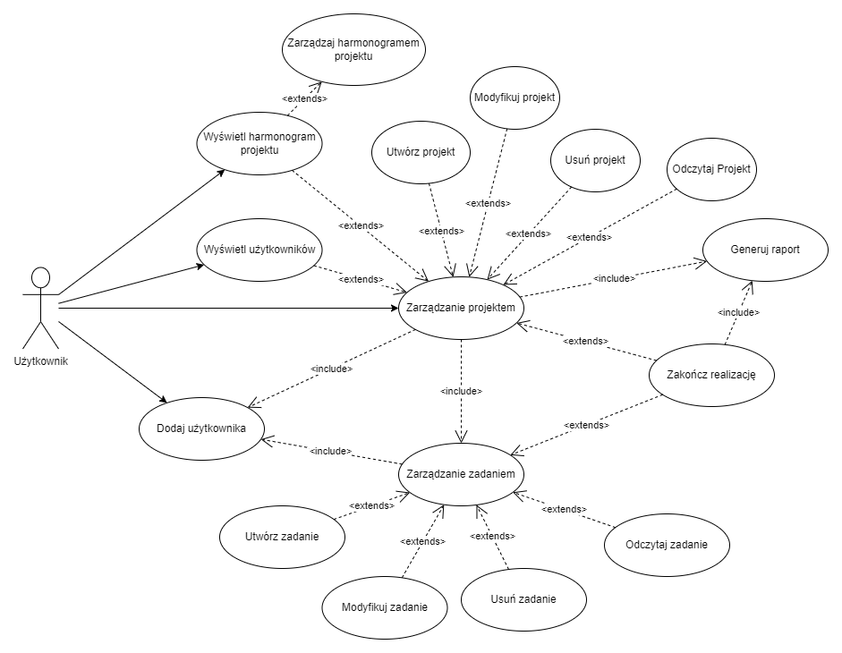

## Wykorzystane technologie

#### Frontend

Widok wizualny stworzono wykorzystując framework [Angular](https://angular.dev/), aplikacja jest typu SPA(Single Page Application). Wykorzystano podstawowe mechanizmy Angulara takie jak Components, Services. Przechodzenie pomiędzy stronami zaimplementowano używając mechanizmu **routingu** Angulara. Widoki tworzone były z użyciem [Bootstrapa](https://getbootstrap.com/). Do komunikacji z serwerem wykorzystano [Axios](https://axios-http.com/docs/intro).

Wykorzystane wersje:

- Angular 17.3
- Bootstrap 5.3.3

#### Backend

Do utworzenie strony backendowej wykorzystano framework [Spring Boot](https://spring.io/projects/spring-boot). Aplikacja serwerowa oparta jest o wzorzec REST wykorzystywany w komunikacji HTTP, gdzie dane zwracane są w postaci JSON. Dostawca bazy danych to [Postgres](https://www.postgresql.org.pl/).

Wykorzystane wersje:

- Spring Boot 3.2.3
- Flyway 9.22.3
- Mapstruct 1.5.5
- Lombok 1.18.30

## Użytkowanie aplikacji

### Logowanie/Rejestracja

Pierwszym widocznym widokiem po uruchomieniu aplikacji jest widok logowania/rejestracji. Tutaj przekazujemy dane użytkownika, po wciśnięciu przycisku "Zaloguj" logujemy się do serwisu:

    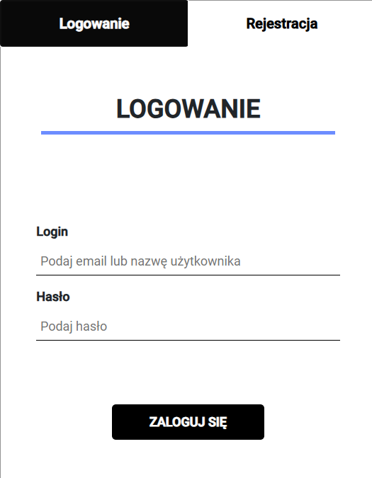

Jeżeli chcemy zarejestrować się do aplikacji, w górnej części możemy przełączyć się na panel rejestracji. Podajemy tam swoje dane osobowe, klikając przycisk `Zarejestruj się` jeżeli dane są prawidłowe zostajemy zarejestrowani do aplikacji:

    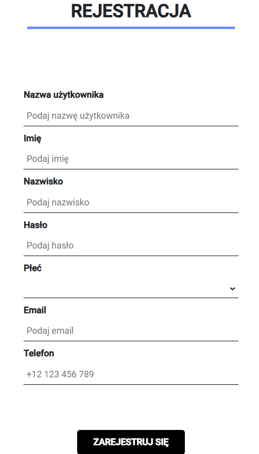

### Panel projektów

Po zalogowaniu się do serwisu pierwszym widokiem jaki nas zastaje jest widok naszych projektów.

    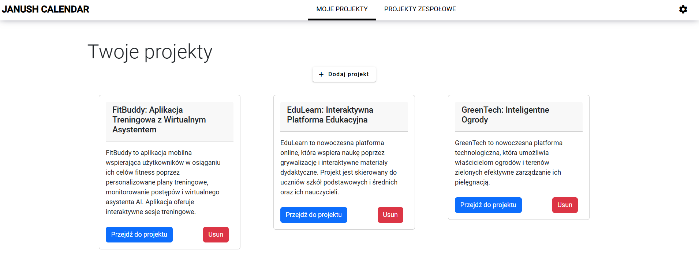

Z początku panel ten jest pusty, bo nie mamy jeszcze żadnych projektów :smiley: . Jeżeli chcemy dodać nowy projekt, możemy to zrobić przy pomocy przycisku `Dodaj projekt` widoczny w górnej części.

    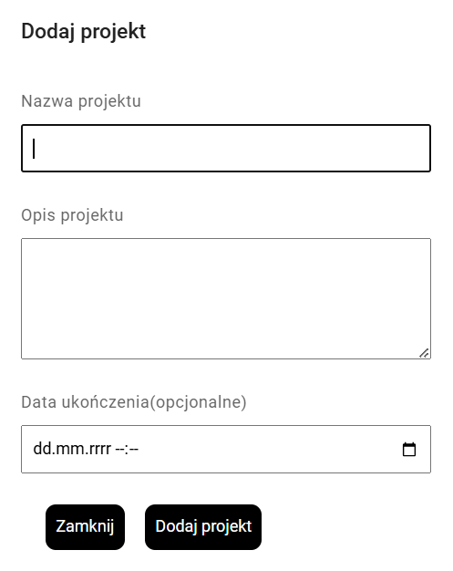

Przy tworzeniu projektu podajemy mu podstawowe dane takie jak: nazwa projektu, opis oraz datę zakończenia (opcjonalna). Następnie klikając przycisk `Dodaj projekt`, jeżeli dane są prawidłowe zostanie on dodany do naszych projektów.

### Informacje o projekcie

Główny panel z projektami daje nam możliwość przejścia do szczegółów takiego projektu. Klikając przycisk `Przejdź do projektu` wyświetlą nam się szczegółowe informacje o projekcie, tak jak poniżej:

    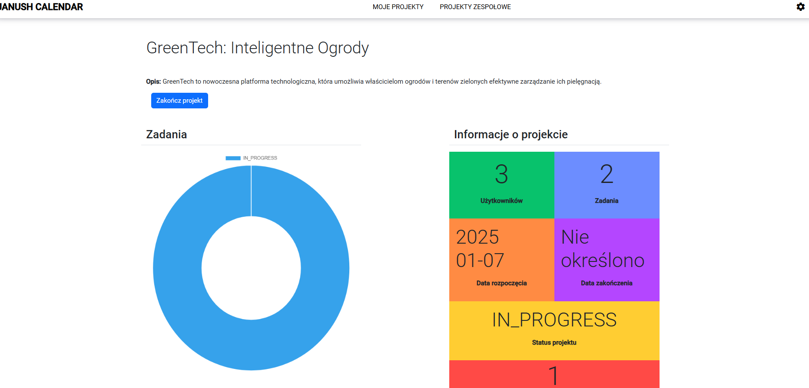

Panel prezentuje bardziej szczegółowe informacje o projekcie. Z lewej strony widoczny jest diagram przedstawiający zadania podzielone ze względu na ich status.

Z prawej strony panelu mamy widok okienek, po których kliknięciu możemy wyświetlić określone informacje.

#### Lista użytkowników

Klikając w okienko z liczbą użytkowników wyświetlają się nam informacje o użytkownikach w projekcie. Są one widocznie poniżej widoku z informacjami projektu:

    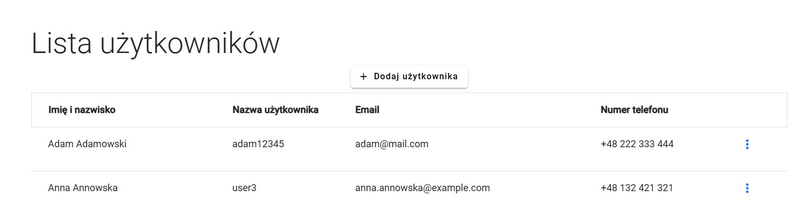

Panel ten umożliwia **dodawanie użytkowników** do konkretnego projektu. Klikając przycisk `Dodaj użytkowników` wyświetla nam się panel dodawania użytkowników, którzy dostępni są w systemie:

    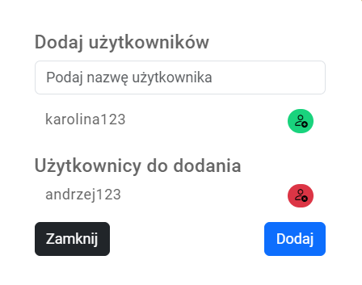

Użytkowników takich możemy wyszukiwać (input na samej górze okna dialogowego), dodawać dynamicznie oraz usuwać. Po kliknięciu przycisku `Dodaj` użytkownicy zostają dodani do projektu.

#### Lista zadań

Kolejne dostępne okno wyświetla informacje o zadaniach realizowanych w projekcie:

    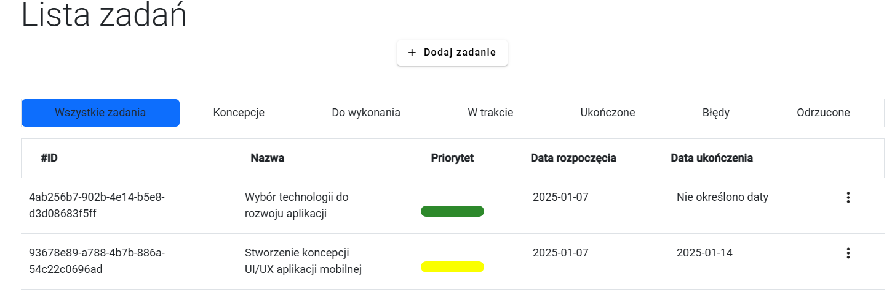

Lista prezentuje tabelę z zadaniami. Takie zadania możemy filtrować w panelu nad taelą, gdzie możemy wyświetlić zadania ze względu na ich rodzaj.

Jeżeli chcemy dodać zadanie do projektu, klikamy przycisk `Dodaj zadanie`, wyświetli nam się okno dialogowe:

    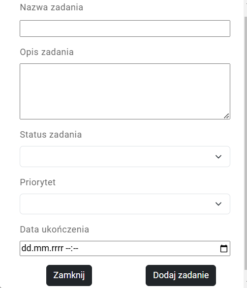

Przekazujemy tutaj podstawowe dane zadania, takie jak: nazwa, opis, status, priorytet, datę ukończenia. Po kliknięciu przycisku `Dodaj zadanie` zostanie ono dodane do projektu, jeżeli dane są prawidłowe.

Tabela z zadaniami umożliwa nam też przejście do danego zadania i wyświetlenia szczegółowych informacji. Klikając "trzy kropki" z prawej strony rekordu w tabeli możemy przejść do określonego zadania. Po przejściu wyświetlany jest następujący widok:

    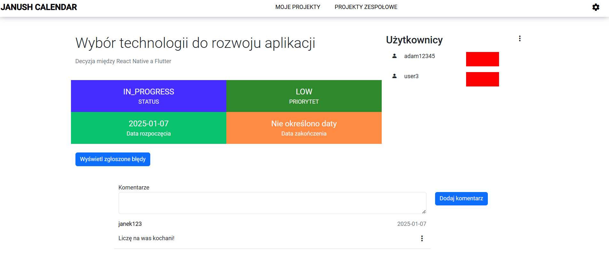

Widok przedstawia bardziej szczegółowe informacje danego zadania:

- status zadania
- priorytet
- datę rozpoczęcia
- datę ukończenia

Dodatkowo mamy listę użytkowników, która przedstawia użytkowników pracujących nad danym zadaniem. Kolor przy danym użytkowniku symbolizuje to czy ukończył on realizację zadania.

Dany uczestnik zadania może je zakończyć klikając przycisk `Zakończ zadanie`, który jest dostępny dla osób będących przypisanych do zadania:

    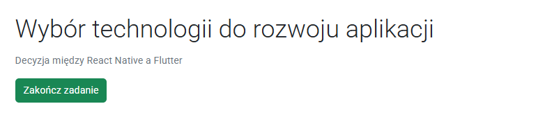

Mamy możliwość dodawania komentarzy do danego zadania, są wyświetlane na samym dole widoku.

Przycisk `Wyświetl zgłoszone błędy` wyswietla błędy do danego zadania. Wyświetlana jest poniższa lista:

    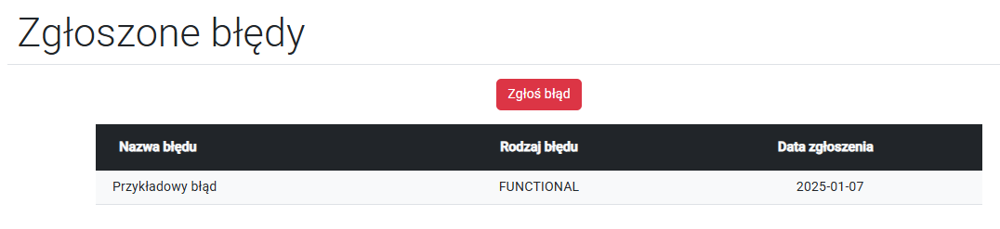

Możemy zgłośić błąd, który wystąpił w zadaniu klikając przycisk `Zgłoś błąd`, wyświetli nam się okno dialogowe, gdzie podajemy informacje o błędzie:

    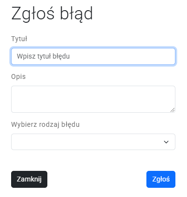

Po kliknięciu przycisku `Zgłoś` błąd zostaje zapisany.

#### Lista błędów

Listę zgłoszonych błędów możemy wyświetlić z panelu projektu klikając na czerwone okienko, ostatnie w prawym panelu. Wyświetla nam się tabela ze zgłoszonymi zadaniami:

    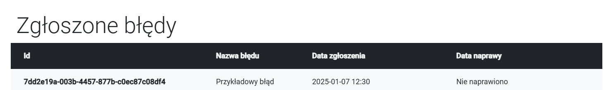

Klikając na dane zadanie możemy wyświetlić dodatkowe informacje:

    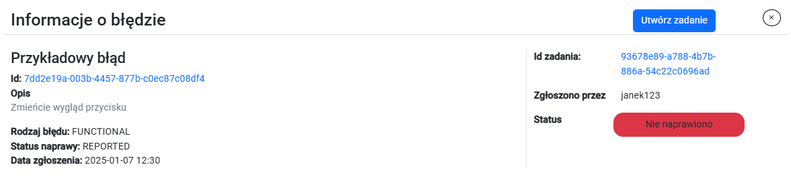

Do danego błędu możemy utworzyć zadanie, mające na celu naprawę tego błędu, tworzenie zadania jest analogiczne jak zostało to opisane wcześniej.

#### Zakończenie projektu

Gdy uważamy, że projekt nasz został ukończony, możemy kliknąć przycisk `Zakończ projekt` dostępny w panelu projektu. Zakończy on realizację danego projektu i wygeneruje prosty raport pdf, zawierający podsumowanie projektu. Warunkiem zakończenia projektu jest to, że nie posiada on aktywnych zadań do realizacji, jeżeli tak jest nie ma możliwości zakończenia projektu.

Wygenerowany raport pdf:

    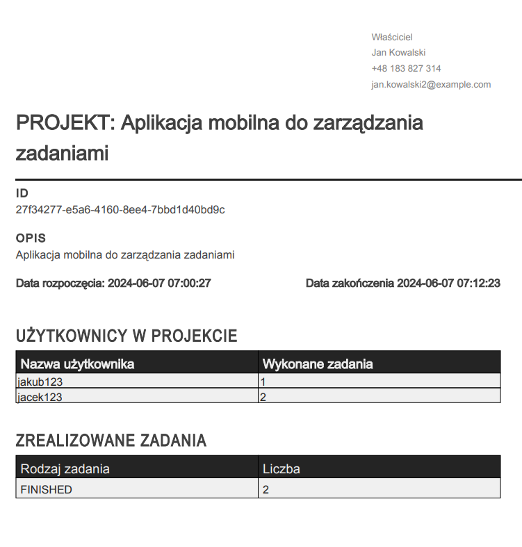

